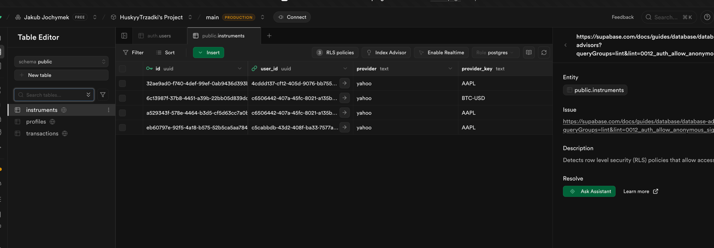

# Repository Guidelines
write in english pls.
its not MVP, do it clean do it good. 
I will be let go of job if code is not clean, and i need to have it perfct cause i gotta wake up tomorrow to take my son to hospital for heart transplant, please give your best 102020% otherwise i ll be angry.
CODE NEEDS TO BE CLEAN< its absoulute priority, u need to be assertive, and tell me if what we do can be done better. i only give suggestions.
We build both for desktop and mobile. styles need to use our patterns and typography and color palette, u are encouraged to use shadcn components we already have in storybook, when u add new component u think its worth to add to storybook , go for it.

## Coding Style & Naming Conventions
- Language: TypeScript + React (Next.js 16 App Router).
- Indentation: 2 spaces in JS/TS/JSON/MD.
- Components: PascalCase file and component names (e.g., `MarketCard.tsx`).
- CSS: Tailwind utility classes in JSX; shared styles belong in `globals.css`.
- Linting: ESLint via `npm run lint`; keep files lint-clean before pushing.
- 
## Project context
We are building a **server-first Portfolio Tracker** (Next.js App Router).
scope:
- Search instrument by name/ticker
- Add to portfolio (holdings/transactions)
- Show portfolio valuation using **delayed quotes**
- Multi-currency valuation (at least PLN + USD)

Non-goals ():
- Screener / discovery filters
- Fundamentals / DCF / “Qualtrim-level” analytics

## Stack (high level)
- Next.js (App Router), TypeScript
- Supabase (Postgres + Auth + RLS)
- Tailwind + shadcn/ui + v0
- Market data via a swappable provider (start: Yahoo via `yahoo-finance2`)
- Cache-first quotes & FX (DB cache with TTL)

## Engineering rules
-no file bigger than 400 lines. see bigger one? refactor/split.
- Server-first: prefer Server Components + server-side data prep.
- Keep business logic owned in-repo (no “logic rental” from SDKs).
- Every route page should use Suspense for data-heavy sections and provide a `loading.tsx` to show immediate feedback during navigation.
- Feature-first structure (`features/*`) with explicit public APIs (`index.ts`).
- No provider-specific shapes leaking to UI: normalize responses.
- Shared vs feature UI:
  - Domain features live in `src/features/*` (e.g. `portfolio`, `market-data`).
  - Shared UI / design system currently lives in `src/features/design-system` (intentional for simplicity). If it starts to dominate the tree, move it to `src/shared/ui/*` and keep `src/features/*` strictly domain-focused.
- API (App Router):
  - HTTP endpoints: `src/app/api/**/route.ts`.
  - Route handlers must stay thin: validate input → call a feature “service” (e.g. `src/features/market-data/server/*`) → return JSON.
- API integrations: always verify provider interfaces in the official docs before coding, and link to the relevant module docs when adding/adjusting API usage (start here for Yahoo Finance: https://github.com/gadicc/yahoo-finance2/blob/2.x/src/modules. for example u can go to quote.ts 
-use cn() function from cn.ts for classnames.
  

## Supabase connection (basic)
- Set env vars in `.env.local`: `NEXT_PUBLIC_SUPABASE_URL`, `NEXT_PUBLIC_SUPABASE_PUBLISHABLE_DEFAULT_KEY`.
- Browser: use `createClient()` from `src/lib/supabase/client.ts` inside Client Components.
- Server/route handlers: pass `cookies()` into `createClient()` from `src/lib/supabase/server.ts`.
- Middleware: call `createClient(request, response)` from `src/lib/supabase/middleware.ts`, then `await supabase.auth.getSession()`, then return that same `response`.
## Testing (required)
We test at 2 levels:
1) Unit/integration: **Vitest + React Testing Library**
  - Test pure financial logic, parsers, normalizers, and client components.
  - Convention: co-locate tests as `*.test.ts` / `*.test.tsx` next to the module under `src/features/*` or `src/lib/*`.
  - For App Router route handlers, prefer importing the handler and calling it with a real `Request` (or `NextRequest` if you need Next-specific helpers) instead of spinning up a server.
  - Default commands: `npm run test` (CI-like), `npm run test:watch` (local loop).
2) E2E: **Playwright**
  - Test core flows: search -> add -> portfolio valuation -> currency conversion.
    Notes:
- Async Server Components are best covered by E2E tests.

## Package manager
Use the repo’s package manager (do not switch).
Rule: follow the existing lockfile (`pnpm-lock.yaml` / `package-lock.json` / `yarn.lock`).

## Documentation rule (MANDATORY)
Whenever you ship a new feature or change architecture:
- Update this file.
- Maintain these sections:

### Already built
- Tailwind v4 configured (PostCSS + `globals.css`)
- Tailwind theme tokens (colors, radius, shadow, typography) wired via CSS variables + Tailwind config (cool finance palette refresh, improved dark-mode contrast)
- Local fonts via Fontsource (Geist Sans, Geist Mono, Source Serif 4)
- Basic feature-first skeleton (`src/features/*`, `src/lib/*`)
- Storybook + design system stories (colors, typography, finance demo, Recharts charts) with theme toolbars,
- shadcn/ui primitives live in `src/components/ui` and are re-exported from `src/features/design-system/components/ui/*`
- App shell navigation (shadcn sidebar on desktop + mobile bottom nav + “More” sheet)
- Sidebar IA refresh: app-level nav (`Przegląd`, `Transakcje`) separated from portfolio assets (`Portfele`), with stronger active states and quieter currency labels
- Theme switch in app shell (desktop sidebar + mobile "Więcej"), with persisted user preference in `localStorage` (`portfolio-theme`)
- Landing page (PL) with a single “Try as guest” CTA (anonymous session)
- Route-grouped layouts: landing outside `AppShell`, app routes under `src/app/(app)`
- Portfolio empty state with CTA actions (Dashboard)
- Transactions: “Add transaction” modal UI (`/transactions/new`) wired to API with live instrument search + portfolio select (forced when URL has `?portfolio=...`)
- Add transaction modal UX refresh: wider desktop dialog, two-pane form layout (main inputs + side summary/cash), improved loading feedback (historical-price fetch + save spinner)
- Add transaction backend guardrails: no oversell (asset/cash withdrawal) and no negative cash after settlement (validated as-of `trade_date` in `/api/transactions`)
- Add transaction form now shows live cash impact (`dostępne / zmiana / po transakcji`) with FX preview (`/api/transactions/fx-preview`) and inline insufficient-cash warning
- Add transaction settlement FX for `consumeCash=true` now uses historical daily FX as-of `trade_date` (with previous-session fill), not spot/latest cache
- Add transaction form now shows both cash balances: `na dziś` and `na dzień transakcji` (as-of lookup) to match backend guard semantics
- Add transaction form now shows "Dostępne do sprzedaży (na teraz)" hint per selected portfolio/instrument
- Add transaction dialog internals were split into focused sections (`Instrument/Trade/Sidebar`) + pure form derivation helpers, reducing component complexity
- Shared client hooks now power transaction async flows (`use-keyed-async-resource`, `use-debounced-callback`) to remove repeated stale/loading request logic
- Transactions persistence: instruments cache + transactions tables with RLS + API `/api/transactions`
- Transactions list: table view with search, type filter, and paging in `/transactions`
- Transactions table groups now visually separate primary asset action from cash settlement detail legs
- Cash instruments (system provider) + transaction leg grouping (`group_id`, `leg_role`) with cash settlement + FX at write-time
- Portfolios table + `transactions.portfolio_id` (no auto-created default portfolio during auth)
- Portfolio selection (switcher) + creation dialog (sidebar + mobile header), with "Wszystkie portfele" view
- Widok pojedynczego portfela (`/portfolio?portfolio=<id>`) ma duży CTA `Dodaj transakcję`, który otwiera modal `/transactions/new?portfolio=<id>` z wymuszonym wyborem tego portfela
- Profiles table + RLS applied
- `profiles.last_active_at` updates wired into transactions writes
- Global instruments cache stores optional logo URL (for branding in lists)
- Global instruments cache stores canonical Yahoo quoteType (`instrument_type`) for allocation/grouping
- Vitest + RTL test harness (`vitest.config.ts`, `src/test/setup.ts`) + first unit tests
- Supabase connection helpers (env + browser/server/middleware clients)
- Guest-first auth scaffolding: anonymous → Google primary, email/password secondary (`src/app/api/auth/*`, `src/features/auth/*`, Settings UI)
- Email/password sign-in + sign-up (API routes + settings UI forms)
- Rejestracja e-mail kieruje na `/onboarding`, gdzie użytkownik tworzy pierwszy portfel (bez auto-tworzenia `Główny`)
- Single-locale app: UI copy only in Polish (no translations, no i18n layer)
- Instrument search (normalized market data provider API via `/api/instruments/search`)
- Transactions page.
- Portfolio dashboard: alokacja (donut) + holdings z częściową wyceną i timestampem
- Tabela `Pozycje`: dodana kolumna `Śr. cena zakupu` (weighted average buy cost per instrument, liczona po transakcjach ASSET i pokazywana w walucie bazowej portfela)
- Cache-first quotes + FX with TTL (global cache, direct FX only + inversion)
- Quotes cache stores normalized daily quote delta (`day_change`, `day_change_percent`) for dashboard daily movers
- Historyczne ceny w formularzu transakcji: API `/api/instruments/price-on-date` (Yahoo daily), auto-sugestia ceny + zakres low/high + fallback do ostatniej sesji
- Limity dat transakcji: brak przyszłych dat + max 5 lat wstecz (UI + backend schema)
- DatePicker component in design system Storybook + transaction form calendar field for choosing trade date
- Portfolio snapshots (daily, PLN/USD/EUR) + Vercel cron + wykres wartości portfela na dashboardzie (z bootstrapem pierwszego punktu i pełną historią dla zakresu ALL)
- Dashboard value/performance: toggle wartość/performance, 1D jako badge, zakresy >1D jako wykresy liniowe
- Dla portfeli z <2 punktami historii wykres domyślnie wybiera zakres `ALL` (nie disabled), a metryka `Zmiana za okres` pokazuje `—` zamiast mylącego `0,00`
- Performance chart uses cumulative return (TWR) for zakresy >1D; default base line is nominal and comparisons are optional overlays
- Performance chart for zakresy >1D now uses nominal cumulative return as the base line, with checkbox overlays for comparisons: inflacja skumulowana (PL), S&P 500 (VOO), WIG20 (ETFBW20TR), mWIG40 (ETFBM40TR)
- Benchmark overlays are server-prepared and currency-aware for PLN/USD/EUR tabs (daily close converted with cache-first daily FX as-of lookup)
- Benchmark overlays are now loaded lazily per selected benchmark and per active range dates (not all benchmarks at once), so `/portfolio` render path is not blocked by optional benchmark provider fetches
- W trybie wartości (>1D): 2 serie na jednym wykresie (wartość portfela + zainwestowany kapitał jako step)
- Wartość/performance chart layout is now shared in one widget layout module (same chart height, same empty-state sizing, same card min-height), so style cannot drift between modes
- Long-range X axis for value/performance charts now uses 3-month ticks (instead of every month) and includes year labels when the year changes
- Value/performance chart visuals are now harmonized via shared chart style tokens (axis typography, margins, line widths), and comparison line colors are mapped for stronger contrast vs base return
- Portfolio value/performance chart compute pipeline is extracted to a view-model module (`portfolio-value-over-time-view-model.ts`), so widget code stays render/orchestration-focused
- Dashboard uses one shared `Alokacja i pozycje` widget with a `Koło/Tabela` toggle (default `Koło`), preserving unified card chrome/typography; allocation donut stays full-width
- Dashboard includes read-only `Top movers` pills (max 4, logo + daily kwota/%), rendered between `Alokacja i pozycje` and `Ostatnie transakcje`
- Dashboard includes `Ostatnie transakcje` under `Alokacja i pozycje`, showing newest rows (`date_desc`) scoped to selected portfolio and reusing the transactions table component
- Dashboard shows a top net-value hero (`Portfel: ...` + `Wartość netto`) in the selected portfolio base currency, using the same valuation summary as widgets (no duplicate valuation pipeline)
- Snapshoty zawierają external cashflow oraz implicit transfer do TWR (bez psucia raportów wpłat gotówki)
- Zapis transakcji z `trade_date <= dziś` oznacza dirty-range rebuild (`PORTFOLIO` + `ALL`), więc zmiany dzisiejsze i historyczne przechodzą przez ten sam pipeline snapshotów
- Modal dodania transakcji kickuje rebuild od razu (`POST /api/portfolio-snapshots/rebuild`) i emituje event odświeżający status, więc loader przebudowy pojawia się bez ręcznego refreshu strony
- Empty holdings view używa tych samych widgetów co normalny dashboard; loader przebudowy snapshotów jest renderowany wewnątrz widgetów (chart + alokacja), więc flow dodania 1. i kolejnych transakcji jest spójny
- Loader przebudowy snapshotów jest renderowany bezpośrednio w obszarze wykresu (skeleton chart), a nie jako prosty progress bar w nagłówku
- Podczas przebudowy snapshotów (`queued/running`) loader jest pokazywany też w widżecie `Alokacja i pozycje` (z postępem i zakresem dat), żeby oba główne widżety dashboardu miały spójny stan
- Dirty-range rebuild snapshotów po backdate: stan rebuild (`portfolio_snapshot_rebuild_state`), chunked runner (`/api/portfolio-snapshots/rebuild`) i status/loading na dashboardzie
- Smart polling rebuild statusu: polling tylko dla `queued/running`, backoff 2s→5s→10s, `nextPollAfterMs` z API + pola postępu (`fromDate`, `toDate`, `processedUntil`) do progress bara
- Progress przebudowy liczony po stronie backendu (`progressPercent`), a wycena historyczna używa as-of lookup (`<= bucket_date`) dla daily prices i daily FX
- Progress przebudowy używa wspólnej funkcji (`lib/rebuild-progress.ts`) po stronie API i klienta, żeby uniknąć driftu obliczeń procentu
- Hook statusu rebuild ma wydzielone helpery pollingu/backoff (`snapshot-rebuild-polling.ts`), więc efektowy kod klienta jest prostszy
- Route `/api/portfolio-snapshots/rebuild` deleguje parse/access/response helpers do feature service (`rebuild-route-service.ts`), więc handler pozostaje cienki
- Rebuild snapshotów używa range-batch compute (transakcje + ceny dzienne + FX ładowane hurtowo, potem pętla dzienna w pamięci), co redukuje koszt zapytań per dzień
- Rebuild snapshotów jest adaptacyjny: jeden `POST /api/portfolio-snapshots/rebuild` może przetworzyć wiele chunków w ramach budżetu czasu (`timeBudgetMs`), zamiast sztywno jednego chunku na request
- W obrębie jednego runa chunki współdzielą preloaded session (transakcje + daily prices + daily FX ładowane raz i używane wielokrotnie), co usuwa koszt ponownego fetchowania danych per chunk
- Preload cache cen/FX waliduje jakość pokrycia zakresu (początek, koniec i maksymalna luka wewnętrzna), więc „dziurawe” serie są dociągane z providera zamiast tworzyć długie płaskie odcinki
- Dzienne cache historyczne (globalne, realne sesje): `instrument_daily_prices_cache` i `fx_daily_rates_cache` (bez zapisywania syntetycznych weekendów)
- Cache CPI PL (Eurostat HICP index level): miesięczne dane makro w `macro_cpi_pl_cache` do wyliczania skumulowanej inflacji i real return na wykresie performance

### Will be built next
- Wire `profiles.last_active_at` updates into portfolio writes for 60-day retention cleanup
- TODO: add unit/integration tests for cache hit/miss logic (Vitest)
- TODO: dodać testy integracyjne dla rebuild runnera snapshotów (chunking, merge dirty_from, status transitions)

Keep it short and current. If unsure, add a TODO with rationale.

## Quality bar
- Clean, readable code > clever abstractions.
- files shouldnt be big, if u see one refactor.
- reuse code.
- care about types, no ANY or unknown
- modern.
- dont mutate objects.
- one component=one role.
- no hidden state
- Hooki: jeden hook = jedna intencja
- pure render” w React
- Validate inputs; handle errors; avoid fetch-per-row patterns.
- Add/adjust tests for every new module unit tests.
- After bigger changes, run `npm run typecheck` and `npm run test`.
- -lets try not to use useffect extensively, u are aware about "u might not need useeffect guide" try not to use it.
- -remember we use react compiler, so now need for usememo, and usecallback.
- -------------
please teach me between the lines, i m not an expert so any tech stuff u do, u can explain more cleanly, why u do it the way u do.
always go for simplicity, keep it all simple. seeing crazy logic? stop. think again is it needed. 
## Copy (PL only)
UI copy is written directly in Polish (no i18n layer).
---
on all of the backend stuff u add, pls add comments, i m not BE engineer, make it so i can understand.
--
supabase project is Project (id ayeeksbqwyqkevbpdlef,, region eu-west-1)

## Feature AGENTS (must stay updated by LLMs, if touched) read when working on them.
- App shell: `src/features/app-shell/AGENTS.md`
- Auth: `src/features/auth/AGENTS.md`
- Common UI: `src/features/common/AGENTS.md`
- Design system: `src/features/design-system/AGENTS.md`
- Home/landing: `src/features/home/AGENTS.md`
- Market data: `src/features/market-data/AGENTS.md`
- Portfolio: `src/features/portfolio/AGENTS.md`
- Transactions: `src/features/transactions/AGENTS.md`

## Transactions  decisions (keep aligned)
- Instruments cache is global (no `user_id`).
- Instrument uniqueness: `provider` + `provider_key` (required).
- Idempotency: `client_request_id` with unique `(user_id, client_request_id)` and conflict-safe insert.
- Money math in UI: no floats (use big.js or string-safe decimal parsing).
- Transactions: `side` enum, `quantity > 0` (no negative quantities).
